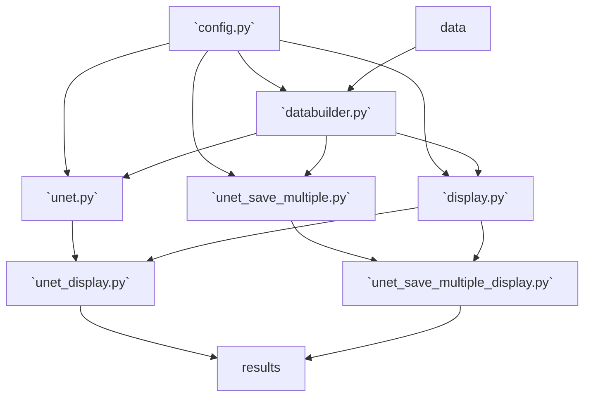

# Overview
This folder contains the deep neural network UNet implementations, which deal with all lines of response within the 9to1 module, and train with all phantoms. They feature an encoding and decoding structure which helps to abstract out the features of interest.

1. `unet.py` contains our basic implementation of the UNet, with implementation to save the final model and final trained system matrix.
2. `unet_save_multiple.py` has the same network as `unet.py`, but incorporates implementation to save the trained system matrix after every epoch.

# Network Design
The goal of our neural network is to recover a system matrix that is useful in PET image reconstruction using the initial Sidon matrix and simulation data. The input for this network is the original, untrained system matrix obtained through Sidon simulation. This data is fed into the network in batches and train the weights and biases in the following manner.

1. The batch of untrained system matrix is passed through the encoding and decoding structure, which also has our weights and biases.
2. The output of step 1 is forward projected by matrix multiplication with the phantom images.
3. The output of step 2 is compared with the ground truth to obtain the loss.
4. The loss is backpropagated and then used to update the model's weights and biases according to gradient descent.
5. Steps 1 - 4 are repeated, with each batch being passed through every epoch and the network performing several epochs to train the network.

After the network is trained, the resulting trained system matrix is extracted by passing the original, untrained system matrix into the encoding and decoding structure (Step 1) in batches. The outputs are saved in their appropriate spots to form the final, trained system matrix. The process is done in batches to be more computationally and time efficient.

# Folder Structure
